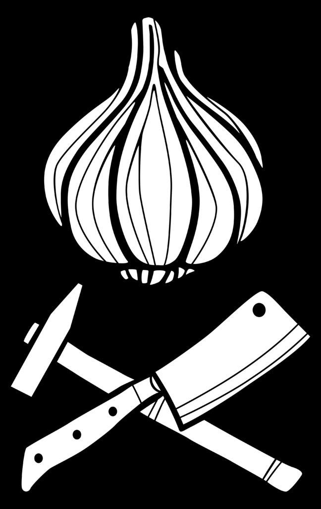

We are being cooked for by our friendly cooking collective Knoblauchfahne. They make breakfast, lunch and dinner and basically cook vegan.

## Get involved

The kitchen is designed as a participatory kitchen. Due to hygiene requirements, not everyone is allowed to stand at the pots, but active help will be required from washing up to chopping to serving. So grab your reference group and discuss how you want to get involved in the camp, be it cooking or something else. If you decide to do a kitchen shift, just come along and ask if and where help is needed. The kitchen will also make itself known at the camp when support is urgently needed.

## Food intolerances

If you have a food intolerance or allergy, please let us know early. You can also put your allergies in the allergy mailbox at the information point on site. The better the kitchen knows, the more precisely they can coordinate how the food is cooked. If possible, separate food is prepared to take intolerances into account.

## Financing

The Knoblauchfahne finances the food and equipment through donations collected on site. If you can afford it, feel free to put a little more than you think into the pot in solidarity to help finance those who have less. If you don't have any cash with you on site, for example, donations for the kitchen are also possible via [Paypal](https://www.paypal.com/paypalme/knoblauchfahne).

## Contact

If you would like to work in the kitchen at the camp for a longer period of time or if you have any questions or suggestions, please use the contact form at https://linktr.ee/knoblauch.fahne
