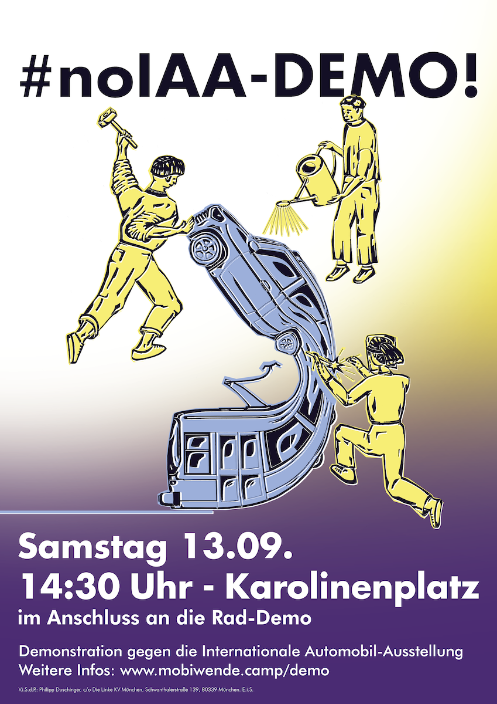

*Die Orga-Gruppe der Demo ist separat von der Orga des Camps. Wir veröffentlichen hier solidarisch ihren Aufruf sowie Infos zu Route, Barrierekonzept, Programm, Spendenmöglichkeit usw.*

## Ort und Zeit

**Samstag, 13.9.2025**

- 14:30 Uhr: Auftaktkundgebung auf dem Karolinenplatz (direkt nach der Schlusskundgebung der [Fahrraddemo](https://www.vcd-muenchen.de/iaa-2025/) am selben Ort)
- 15:00 Uhr: Demozug zum Mobilitätswendecamp, ca. 4,5 km mit Tramgleisen  
  Karolinenplatz - Barerstraße Adalberstraße - Ludwigsstraße - Zwischenkundgebung: Siegestor - Akademiestraße - Adalberstraße - Barerstraße - Nordendstraße - Belgradstraße - Karl-Theodor-Straße - Mobilitätswendecamp im Luitpoldpark
- 16:30 Uhr: Abschlussparty auf dem Camp im Luitpoldpark

## Aufruf

Im September macht sich die Internationale Automobilausstellung (IAA) ein drittes Mal in München breit. Orte der Stadtgesellschaft werden als große Werbeflächen missbraucht. Während alle zivilgesellschaftlichen Proteste der vergangenen Jahre missachtet wurden, hat die Stadt der Autolobby "Verband der Automobilindustrie" mehr Flächen überlassen. Gesellschaftliche Initiativen bekommen nicht nur keine Gelder mehr, sondern auch so gut wie keinen Platz. Auf unseren Plätzen werden Luxus-Autos ausgestellt, die sich nur Wohlhabende leisten können. Gleichzeitig wissen viele Menschen in München nicht mehr, wie sie ihre Mieten bezahlen sollen. Mit der IAA versucht die gebeutelte Autoindustrie, ihr Image wieder auf Hochglanz zu polieren, das Automobilgeschäft anzukurbeln und Menschen für eine Form der Mobilität zu begeistern, die uns in tiefe Krisen führt.

Denn die IAA ist nicht nur eine Autowerbeshow. Sie ist ein Symbol der Profitmaximierung auf Kosten von Mensch und Umwelt. Hinter der IAA stehen Konzerneigner:innen und -vorstände, die sich durch Krisen, die sie mitverursacht haben__,__ goldene Nasen verdienen. So haben ihr Produkt Auto und die dafür notwendige Infrastruktur die globale Klimakrise mitverursacht. Während weltweit Wälder und Häuser in Flammen stehen, ganze Orte überschwemmt und Ernten vernichtet werden, zählen die Krisenverursachenden ihre Dividenden. Für Automobilität werden fossile Brennstoffe verbrannt, Ressourcen ausgebeutet, Wälder zerschnitten, Flächen versiegelt, die Luft verpestet. Die Bahn sowie der ÖPNV als echte Alternative zum Auto werden weiterhin kaputtgespart und Schienen teilweise rückgebaut, sodass der öffentliche Verkehr für viele Menschen zu unzuverlässig und zu teuer ist - viele Pendler:innen sind entgegen ihres Willens auf das Auto angewiesen. Elektro-Autos sind keine Alternative: Für den Abbau der benötigten Rohstoffe werden Menschen im globalen Süden aus ihren Heimatorten vertrieben, Umweltgifte aus den Minen verpesten ihr Trinkwasser und niedrige Arbeitsstandards gefährden die Beschäftigten und führen sogar zum Tod. Alles für den Erfolg von BMW, Daimler, VW und Co. Die Konzernführungen wälzen über Leiharbeit und Entlassungen die selbsterzeugten Krisen auf die Lohnabhängigen ab. Um trotz fehlendem technologischen Fortschritt weiterhin Renditen zu erzielen, werden verschiedene Werke zunehmend auf das Geschäft mit dem Krieg umgestellt. Eine Transformation der Automobilindustrie hin zu gesellschaftlich nützlichen und klimaneutralen Produkten wie Bussen und Bahnen ist aber angeblich nicht möglich.

Wir stehen für eine umfassende Wende dieser Verhältnisse!

- nachhaltige, barrierefreie und kostenlose Mobilität für alle: Busse, Bahnen, Trams usw.!
- öffentliche  Flächen für die Bedürfnisse der Münchner:innen: Spielplätze,  Begegnungs- und Lernorte, Freiflächen, Stadtgärten, Wildnis, Kultur
- weitgehend autofreie Städte mit kurzen Wegen
- Renaturierung versiegelter Flächen
- kein weiterer Autobahnaus- und -neubau
- ökologische und sozial gerechte Transformation der Autoindustrie

Zusammengefasst: eine Welt der Bedürfnisse statt der Profite, eine Welt der Menschenrechte statt Ausbeutung anderer Länder - eine Welt der (Klima-)Gerechtigkeit statt Kapitalismus! Eine Welt ohne die IAA!

Lasst uns am 13.09. am Karolinenplatz zeigen: Wir wollen nicht länger zurückstecken, während Konzernleitungen und Großaktionär:innen weiter Überreichtum für sich generieren!  
**#BedürfnisseStattProfite #MobilitätFürAlle #noIAA #SystemChangeNotIAA**

## Weitere Informationen

### Programm

- Es wird eine halbstündige Auftaktkundgebung mit vier Reden sowie eine Zwischenkundgebung mit einer Rede geben, nähere Infos folgen.
- Außerdem dürft ihr euch auf einen Auftritt von [StreetOps Music](https://www.streetopsmusic.de/) freuen.
- Direkt vor unserer Kundgebung findet auf derselben Bühne die Abschlusskundgebung der [Fahrraddemo](https://www.vcd-muenchen.de/iaa-2025/) von VCD und BUND mit weiteren Redner:innen und Musik statt.

Diskriminierende und menschenverachtende Äußerungen, Symbole und Verhaltensweisen sind auf der Demo nicht erwünscht. Wir behalten es uns vor, Leute, die derartige Einstellungen zeigen, von der Versammlung auszuschließen.

### Infos zu Barrieren

- Reden werden in Gebärdensprache gedolmetscht. 
- Übersetzungen der Reden in Englischer Sprache werden mit QR Codes vor Ort zur Verfügung gestellt.
- Strecke: ca. 4,5 km mit Tramgleisen

### Social Media und Kontakt

Telegram-Infokanal *(gemeinsam mit anderen Gruppen)*: [#blockIAA](https://t.me/blockiaa)  
Instagram: [noiaa.muc](https://www.instagram.com/noiaa.muc/)  
X: [#blockIAA Demo](https://x.com/no_iaa)  
Kontakt: [iaa-demo@riseup.net](mailto:iaa-demo@riseup.net)  
Pressekontakt: [demo.presse@noiaa.de](mailto:demo.presse@noiaa.de)  
Pressenummer: +49 8139 9994647

## Pressemitteilungen

- [Pressemitteilung vom 18.08.2025](https://noiaa.de/wp-content/uploads/2025/08/2025-08-18_PM_noIAA.pdf) (externer Link)
- [Pressemitteilung vom 12.09.2025](https://noiaa.de/wp-content/uploads/2025/09/2025-09-12_PM_noIAA.pdf) (externer Link)
- [Pressemitteilung vom 13.09.2025](https://noiaa.de/wp-content/uploads/2025/09/2025-09-13_PM_noIAA.pdf) (externer Link)

## Mobimaterial

[Mobi-Flyer](https://noiaa.de/wp-content/uploads/2025/08/noIAA-Demo-Flyer.pdf) (externer Link)

#### Poster

### Unterstützende Gruppen

- Antikapitalistische Linke Bayern / München
- Antikapitalistisches Klimatreffen Augsburg
- Attac
- BUNDjugend Bayern
- DIDF
- Die Linke KV München
- Extinction Rebellion München
- Freiräumen München
- Fridays for Future München
- In Aktion gegen Krieg und Militarisierung (AKM) München
- Interessengemeinschaft der Erwerbslosen (IGEL) München
- Kolibri Kollektiv
- Kritische Nachhaltigkeit e.V.
- Mehr Lärm für München 
- Neue Generation München
- Nord-Süd-Forum München
- Offenes Antikapitalistisches Klimatreffen München
- Ökoesel München
- Ökumenisches Büro für Frieden und Gerechtigkeit e.V.
- Parents for Future München
- Robin Wood
- Sand im Getriebe
- Umweltgewerkschaft München
- Widerstandskollektiv München
- workers for future München
