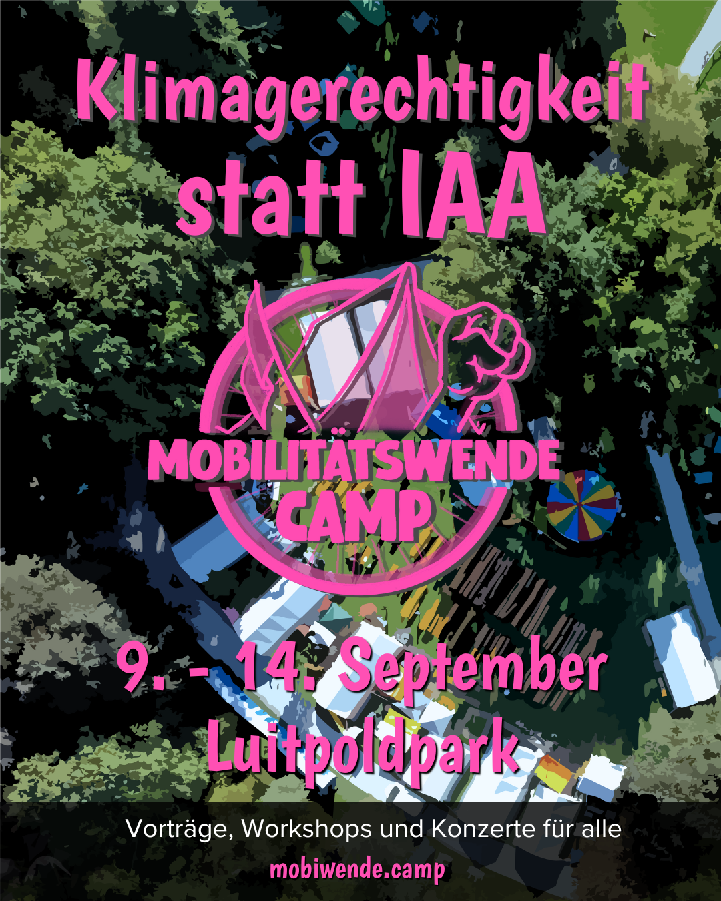
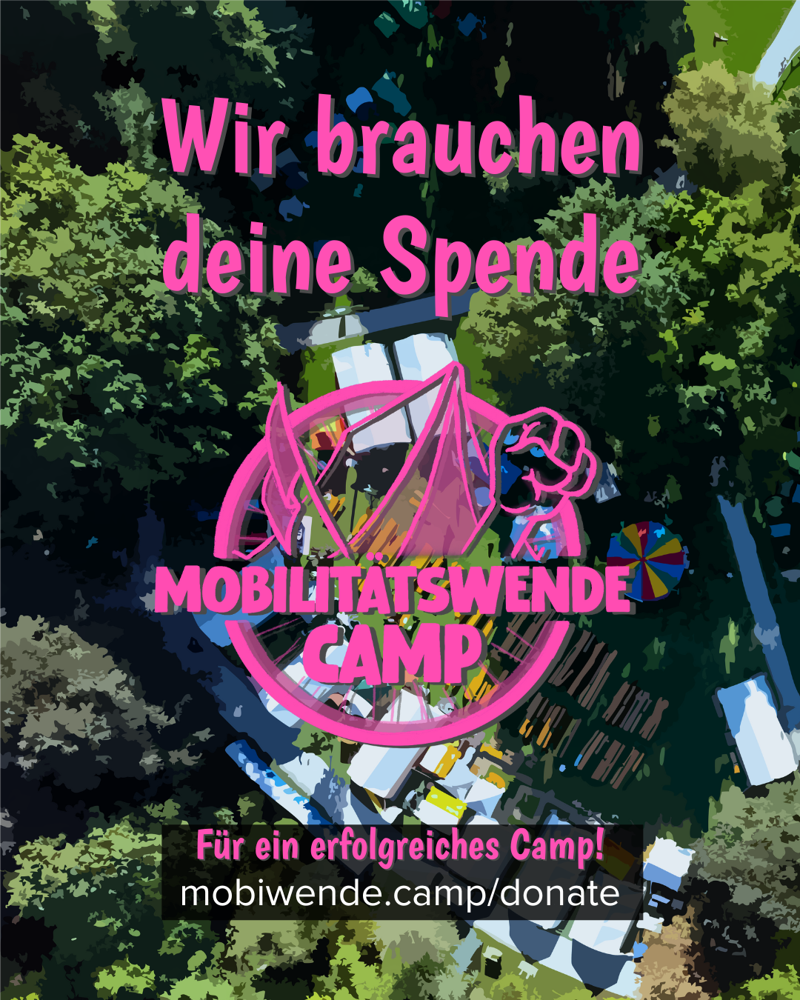

## Wir brauchen Hilfe bei der Mobilisierung!

Uns ist wichtig, dass möglichst viele Menschen das Mobilitätswendecamp besuchen. Dafür brauchen wir Werbung und dabei können wir deine Hilfe gebrauchen.

Dafür kannst du Inhalte auf unseren Social-Media-Kanälen teilen. 

```
<SocialMedia />
```

Aber es gibt auch mehr Optionen

Hier findest du Mobil-Materialien, welche du frei verwenden kannst:

## Sharepics



Das Mobilitätswende-Camp ist zurück! 

Die IAA steht vor der Tür – und auch unser Camp ist bald bereit. Gemeinsam setzen wir uns ein für eine echte Verkehrswende: mit Workshops, Vorträgen, Kunst, Musik und vielem mehr. 

Sei dabei – vom 9. bis 14. September im Luitpoldpark! Ob für einen Tag, zum Übernachten oder einfach zum Reinschnuppern – wir freuen uns auf dich.   

Du willst mit anpacken? Wir können immer Hilfe gebrauchen: Ob Orga, Anpacken oder Auf- und Abbauen.

 Mehr Infos & Mitmachen: [__mobiwende.camp__](http://mobiwende.camp)



Spende jetzt und hilf uns, den Kampf für eine gerechte und klimagerechte Stadt weiterzuführen!   Jeder Euro zählt! [__https://www.mobiwende.camp/donate__](https://www.mobiwende.camp/donate) 

##   
Flyer (zum Selberdrucken)


Falls du in München bist, können wir dir Flyer zur Verfügung stellen. Falls nicht, bitte gerne selber drucken: [**Druckdatei**](https://cloud.systemli.org/f/9708963)

## Sticker


Sticker gibt's in München, außerhalb gerne selber drucken: [**Druckdatei**](https://cloud.systemli.org/f/9709197)